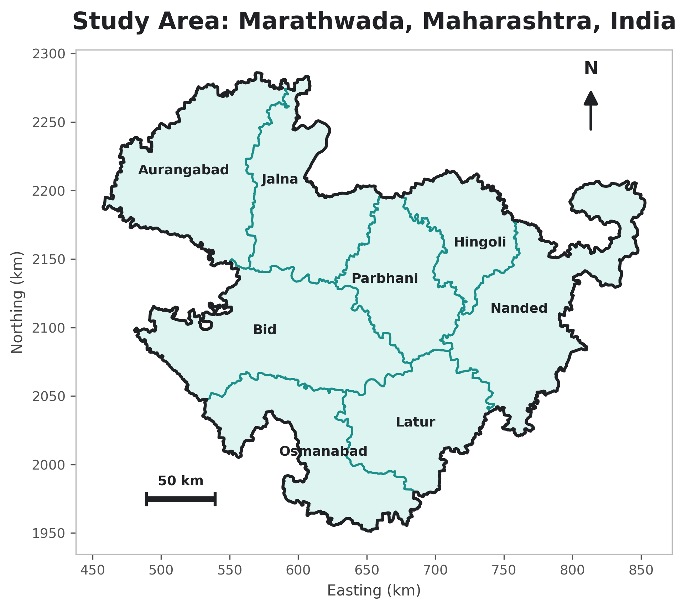

# Testing the Fluorescence Advantage: Solar-Induced Fluorescence as an Early Indicator of Agricultural Drought Stress in Marathwada, Maharashtra

Sakshi D. Maske

Independent Geospatial Researcher, Nagpur, Maharashtra, India

ORCID: [0009-0002-5683-5966](https://orcid.org/0009-0002-5683-5966)

Corresponding author: [sakshimaske303@gmail.com](mailto:sakshimaske303@gmail.com)

## Highlights

- SIF's decline came before NDVI's in 8 of 9 growing seasons studied.
- Drought years did not show a bigger SIF-NDVI lag than normal years.
- A cross-correlation check found NDVI leading SIF in 3 of 9 years.
- Satellite signals beat the 2018 official drought declaration by 7-8 weeks.
- Official crop-yield statistics independently confirm both drought years' stress.

## Abstract

Drought detection in India, for official declarations and crop-insurance payouts (PMFBY), still leans on rainfall records and NDVI, which only respond once a crop is already damaged. This study tests whether Solar-Induced Fluorescence (SIF), tied to photosynthesis, detects stress earlier than NDVI, using GOSIF v2 SIF and MODIS NDVI across 8 Marathwada districts over 9 growing seasons (2015-2023), against a 20-year rainfall climatology. Only 2 of the 9 years, 2015 and 2018, met this study's drought threshold. Under a threshold-crossing method, SIF's decline preceded NDVI's in 8 of 9 years, with 2018 a near-flat exception; drought years did not show a bigger lag than normal years (7.6 vs 15.1 days), so H3 is not supported. A separate cross-correlation check was more mixed: SIF led in 5 years, tied in 1, and NDVI led in 3 (2018, 2022, 2023), backed in 2022-2023 by bootstrap replicates over 99% below zero. SIF and rainfall anomaly correlated significantly at the district level (r = 0.531, p < 0.0001, n = 72 district-years). Both SIF and NDVI crossed their stress thresholds roughly 7-8 weeks before Maharashtra's 2018 drought declaration. Official Kharif crop-yield statistics independently show lower yield anomalies in the two drought years than normal years (-1.08 vs. +0.07, n = 8), consistent with this classification, though not significant given the small drought-year group. SIF shows a real, physically grounded lead over NDVI in most years but not every year; the bigger opportunity is satellite monitoring generally arriving well ahead of the current declaration process.

**Keywords**: solar-induced fluorescence, remote sensing, drought monitoring, NDVI, agricultural stress, Marathwada

## 1. Introduction

### 1.1 Motivation

NDVI is a reflectance-based measure — it tracks how much visible and near-infrared light a plant canopy bounces back, and that reflectance only shifts once a plant's internal structure has already started to visibly break down: thinning leaves, fading chlorophyll, canopy stress. SIF works on a more direct physical principle. When a leaf absorbs sunlight for photosynthesis, a small slice of that energy never gets converted to chemical energy at all; instead it's re-emitted as fluorescence, governed by photosynthesis's quantum yield. Photosynthetic efficiency drops under stress before a plant's outward greenness does, so SIF should, in principle, catch stress earlier than NDVI can. NDVI is a measure of what a plant looks like from outside; SIF is a satellite signal more directly linked to the plant's photosynthetic activity — a real-time physiological correlate, not a direct measurement of internal plant state. Whether that physical head start actually shows up, reliably, as a measurable timing difference in the two satellite products used here is the empirical question this study tests, not something the physical mechanism alone can guarantee.

India's drought-declaration process, and the PMFBY crop-insurance payout mechanism riding on it, leans heavily on rainfall deficit and NDVI. Both are known to catch drought only once visible crop stress has already taken hold, and that lag turns into delayed payouts exactly when affected farmers need the money most. This study treats the SIF-NDVI lag — whether it exists at all, and how big it is — as a testable empirical question, aiming to establish whether it amounts to a physics-based case for an earlier-warning indicator than what policy currently uses.

### 1.2 Physical Basis of Solar-Induced Fluorescence

A leaf absorbing photosynthetically active radiation splits that energy across three competing, mutually exclusive pathways at the chlorophyll level: photochemistry (Φ_P), non-photochemical quenching or heat dissipation (Φ_NPQ), and chlorophyll fluorescence (Φ_F). Together these three account for all of the absorbed energy, per the conservation relationship:

Φ_P + Φ_NPQ + Φ_F = 1

Under normal, well-watered conditions, most of that absorbed energy goes toward photochemistry, and only a small, fairly stable share comes back out as fluorescence. Drought or heat stress changes that balance: the photochemical pathway gets down-regulated as the plant protects its photosynthetic machinery from damage, while non-photochemical quenching ramps up to shed the resulting surplus energy as heat. The fluorescence yield shifts as this re-partitioning happens — measurably, and before any outward change in canopy structure or greenness — which is exactly why SIF should out-pace reflectance-based indices like NDVI as an early-warning signal (Figure 1).

The magnitude of the fluorescence signal actually detected by a satellite sensor, denoted SIF, is the product of three quantities:

SIF = APAR × Φ_F × f_esc

where APAR is the absorbed photosynthetically active radiation, Φ_F is the fluorescence quantum yield described above, and f_esc is the fraction of emitted fluorescence photons that escape the canopy without being reabsorbed. Because chlorophyll fluorescence is several orders of magnitude weaker than reflected sunlight at the same wavelengths, it cannot be measured through simple radiance detection. Satellite-based SIF retrievals, as performed by instruments such as GOME-2, OCO-2, and TROPOMI, instead exploit narrow, naturally dark absorption features in the solar spectrum — Fraunhofer lines — where the additional radiance contributed by fluorescence emission can be isolated from the reflected background. The GOSIF product used in this study is not itself a direct satellite retrieval, but a statistically modeled reconstruction combining discrete OCO-2 SIF soundings with continuous MODIS reflectance data and meteorological reanalysis to produce spatially and temporally continuous global coverage.

**Figure 1.** Schematic representation of leaf-level light energy partitioning among photochemistry, non-photochemical quenching (heat dissipation), and chlorophyll fluorescence, under well-watered versus drought-stressed conditions.

### 1.3 Physical Basis of NDVI

NDVI comes from surface reflectance in the red and near-infrared bands:

NDVI = (NIR − RED) / (NIR + RED)

The formula leans on a specific optical quirk of healthy plant tissue. Chlorophyll pigments in the leaf's palisade mesophyll soak up red light heavily to drive photosynthesis, so red reflectance stays low. Near-infrared light behaves the opposite way: the leaf's internal structure — specifically the irregular air-cell interfaces in the spongy mesophyll — scatters it strongly, because of the refractive-index mismatch between cell walls and the air pockets between them, giving high near-infrared reflectance that has little to do with chlorophyll content (Figure 2). A canopy full of healthy, chlorophyll-rich foliage ends up with a wide gap between low red and high near-infrared reflectance, which is what a high NDVI value captures; a canopy losing structure — thinning leaves, shrinking leaf area, senescence — narrows that gap and pulls NDVI down.

Because it depends on the plant's outward structure and pigment state, NDVI is inherently a step behind the internal physiological changes that come before visible degradation. Cloud and cloud-shadow contamination from Mie scattering adds further noise to the optical NDVI signal — handled here by screening every pixel through MOD13Q1's `SummaryQA` quality flag before any analysis (Section 3.1). NDVI's appearance-based footing sits in direct physical contrast to SIF's internal-process basis (Section 1.2), and that contrast is the central premise this study puts to the test.

**Figure 2.** Leaf cross-section illustrating red-light absorption by chlorophyll in the palisade mesophyll versus near-infrared scattering at spongy mesophyll air-cell interfaces, the physical basis of the reflectance contrast measured by NDVI.

### 1.4 Research Questions

RQ1: Does SIF decline measurably earlier than NDVI across this study's growing seasons, and does that pattern also hold in years classified as drought under this study's own rainfall-anomaly criterion (Section 3.5)?

RQ2: Is the SIF–NDVI lag, where present, consistent across the study region, or does it vary meaningfully by geography?

RQ3: How does the timing of SIF-based stress onset relate to independently measured rainfall deficit across drought and normal years?

### 1.5 Hypotheses

H1: SIF declines measurably before NDVI across the study period, including during drought episodes.

H2: The magnitude of SIF–NDVI divergence is not spatially uniform across the study region.

H3 (exploratory): Drought severity, measured independently through rainfall deficit, amplifies the magnitude of the SIF–NDVI lag. This hypothesis is tested as an exploratory comparison, not a confirmatory one: with only two years (2015, 2018) meeting this study's own drought threshold (Section 3.5), any drought-versus-normal comparison in this dataset rests on an n of 2, which is too small to treat a group-level statistical test as confirmatory evidence either for or against H3. What this study can and does report is more limited but still meaningful: whether the two specific drought years observed here happened to show a larger or smaller lag than the six normal years observed alongside them.

## 2. Study Area

The study covers all eight districts of Marathwada, Maharashtra — Chhatrapati Sambhajinagar (Aurangabad), Jalna, Parbhani, Hingoli, Nanded, Beed (called "Bid" in the FAO GAUL administrative dataset used for boundary definition (FAO, 2015); see Section 3.2), Latur, and Dharashiv (Osmanabad) — chosen for its long, well-documented history of agricultural drought.

**Figure 3.** Study area: the eight constituent districts of Marathwada, Maharashtra, India, with district boundaries and names labeled.

## 3. Data and Methodology

### 3.1 Data Sources

Four datasets went into this study, all covering the June 1 – December 27 window (day-of-year 153–361) across nine study years — 2015, 2016, 2017, 2018, 2019, 2020, 2021, 2022, and 2023. 2021 was the last year folded in, and it took two passes to get there. NDVI and rainfall for 2021 came first, during a follow-up check on whether skipping 2021 in the original eight-year expansion happened to hide an inconvenient year: the region saw 969.95 mm of seasonal rainfall that year, an anomaly z-score of +0.90 against the same 2001-2020 baseline used throughout this study — a wetter-than-normal year, not a drought year, so its earlier exclusion was not concealing a drought season. SIF for 2021 took a second pass, since GOSIF's raw 8-day GeoTIFFs aren't distributed through Earth Engine and had to be downloaded by hand from the source university server; once the correct 27 composite files were in hand, they went through the same clip-to-boundary, region- and district-level aggregation pipeline as every other year (GA_Development_Log.md Entry 20 has the full account, including two wrong-file download attempts along the way). 2021 is now a full ninth study year behind every result in this paper, not a partial or side-file addition.

- **SIF:** GOSIF v2, a global 0.05°, 8-day solar-induced fluorescence product (Li & Xiao, 2019), distributed by the Global Ecology Group, University of New Hampshire.
- **NDVI:** MODIS MOD13Q1 (Didan, 2021), a 16-day, 250 m Vegetation Index product with an internal Maximum-Value-Composite cloud-suppression algorithm, accessed via Google Earth Engine.
- **Land cover:** MODIS MCD12Q1 (Friedl & Sulla-Menashe, 2022) (IGBP classification), used to derive a cropland mask (classes 12, 14).
- **Precipitation:** CHIRPS daily rainfall (Funk et al., 2015), accessed via Google Earth Engine, for all nine study years and for a twenty-year (2001–2020) climatological baseline.

Three properties of this dataset combination matter for how the rest of this paper's results should be read, and are stated here up front rather than left for Section 6. First, GOSIF is not a direct satellite retrieval of fluorescence; it is a statistically modeled reconstruction trained on discrete OCO-2 SIF soundings using continuous MODIS reflectance (including MODIS EVI) and MERRA-2 meteorological reanalysis as predictors (Li & Xiao, 2019). Because MODIS reflectance data feeds into both the GOSIF reconstruction and, separately, the MOD13Q1 NDVI product this study compares it against, the two sides of this study's central comparison are not built from fully independent underlying measurements. This is why this study's central comparison is described throughout as a test of two operational, partially input-linked remote-sensing products, not as a clean experimental test of independent physiological versus structural response — Section 4.10 and Section 6 return to what that does and does not undermine about the reported lag. Second, GOSIF's native 0.05° grid (roughly 5 km) is far coarser than MOD13Q1's 250 m, so every comparison in this study is a regional- or district-scale seasonal signal, not a field- or crop-scale one; the policy and physiological interpretations offered later apply at that regional scale. Third, the cropland mask (MCD12Q1 classes 12 and 14) includes class 14, "cropland/natural vegetation mosaic," alongside class 12's pure cropland, so the masked signal reflects a mixed agricultural-and-natural-vegetation landscape rather than cropland alone; this study does not separately test whether restricting the mask to class 12 changes the reported lag.

The study started with three years (2015, 2018, 2020); five more (2016, 2017, 2019, 2022, 2023) were added later specifically to fix the small-sample limitation flagged in every earlier version of this paper's Section 6, and 2021 was added last, once its raw GOSIF files were tracked down and processed by hand. The pipeline itself didn't change across any of these additions — same GOSIF product, same MOD13Q1/SummaryQA/cropland-mask NDVI pipeline, same FAO GAUL district boundary (Section 3.2) throughout — so the same method was used for all nine years. Different approaches were not mixed together here.

### 3.2 Boundary Definition and Verification

The study boundary comes from the FAO GAUL 2015 level-2 administrative dataset, filtered down to the eight Marathwada districts and merged into one precise polygon. An initial rectangular bounding box came first, but visual inspection showed it spilling beyond Marathwada into neighboring Telangana districts and into Solapur and Yavatmal — areas with their own, different rainfall regimes that have no business being in this study. Both the SIF raster-clipping pipeline (polygon-based masking) and the NDVI extraction pipeline (the same polygon as the reducer geometry) were rebuilt against this corrected boundary.

A second, more subtle boundary bug turned up during the sample-size expansion from Section 3.1. The district-name list used to build this polygon from FAO GAUL's `ADM2_NAME` field spelled the district "Beed" — the common English spelling — but FAO GAUL 2015 itself spells it "Bid." A filter on a name that matches nothing just returns an empty result instead of throwing an error, so this quietly dropped Bid district from the merged region boundary and every district-level export, corrupting the region-wide SIF, NDVI, and rainfall statistics for all eight years the first time the expanded extraction ran. Nothing flagged this as an error; it surfaced only because the by-district output had 56 rows where 64 were expected. Once the spelling was fixed, the full extraction was re-run and re-verified before any number in this paper was computed. Every statistic reported here reflects the corrected, eight-district boundary.

After the original 2015 boundary fix, the masking behavior got an independent check too: overlaying the true boundary polygon on a sample clipped SIF raster confirmed that data survived only inside the actual district outlines and nowhere else.

**Figure 4.** Verification of boundary masking: clipped SIF data (color) overlaid with the true Marathwada district boundary (blue outline), confirming that raster values are correctly excluded outside the study region.

### 3.3 Processing Pipeline

SIF GeoTIFFs were clipped to the study boundary, scaled by GOSIF's 0.0001 factor, and masked for fill-value codes (32766 for water, 32767 for non-vegetated/missing) before averaging. NDVI came from MOD13Q1's `SummaryQA` band — keeping only good- and marginal-quality pixels — combined with the cropland mask. Since the two series run on different native temporal resolutions (8-day SIF, 16-day NDVI), they were aligned within each year by matching to the nearest date.

### 3.4 Lag Calculation

Each year's SIF and NDVI series was normalized (0–1) within that year, and linear interpolation between observed dates pinned down the day-of-year each series crossed a set of decline thresholds (90%, 80%, 70%, 60%, 50% of seasonal peak). Lag, here, is simply the gap between the NDVI and SIF crossing dates at each threshold.

### 3.5 Rainfall Validation

CHIRPS-derived seasonal rainfall totals for all nine study years were compared against a twenty-year (2001–2020) climatological mean and standard deviation for the same region and seasonal window, giving a percentage anomaly and z-score per year. The same regional climatological baseline was extended down to the district level as a shared reference across all eight districts. This study calls a year a drought year when its seasonal rainfall anomaly sits at least half a climatological standard deviation below the mean (anomaly z-score < −0.5) — the same threshold that, implicitly, separated the original study's two drought years from its one normal year, now spelled out explicitly and applied evenly across all nine years instead of assigned by outside knowledge.

### 3.6 Cross-Correlation Robustness Check

The threshold-crossing method (Section 3.4) reads lag off the moment each series crosses a given share of its own seasonal peak — most sensitive to the *onset* of decline, especially at high thresholds. To check whether that specific choice of method is what drives the reported lag values, a second, methodologically distinct estimate was built using time-lagged cross-correlation, which asks a different question: what single time-shift best lines up the two curves' overall shape across the whole post-peak decline window? I'm calling this "methodologically distinct" rather than "independent" on purpose — it still runs on the exact same SIF and NDVI series for the exact same years, just a different piece of math, so it isn't a second independent dataset the way an independent check normally would be. For each year, both series — normalized 0–1, restricted to the post-peak decline phase starting from SIF's own peak — were interpolated onto a common daily grid, de-meaned, and cross-correlated at lags from −N/4 to +N/4 days, where N is the decline window's length in days (a standard bound that keeps the estimate away from the unreliable, boundary-pinned values that show up once tested lags approach the full series length). Whichever lag maximized the correlation between SIF(t) and NDVI(t + lag) became that year's cross-correlation-based estimate — a positive lag means NDVI is behind SIF (SIF leading), a negative lag means the reverse (NDVI leading).

An earlier version of this script only searched lags from 0 to N/4, never letting the tested lag go negative. I caught this while going back through the code for this round of checks: searching only non-negative lags means the method could never come back with an answer where NDVI leads SIF, no matter what the actual data looked like — so a result like "the lag was never negative" wasn't really a finding, it was just describing the search space I'd built. I fixed the script to search the full −N/4 to +N/4 range and reran it from scratch. Section 4.6 reports what came out of the corrected version.

### 3.7 Uncertainty Quantification (Bootstrap Confidence Intervals)

Section 3.6's cross-correlation lag estimates are point estimates drawn from a small handful of discrete satellite observations per year — 14 to 18 post-peak, SIF/NDVI-matched 8-day observations, depending on that year's decline window. To gauge how much these estimates could plausibly move given how sparse the underlying observation dates are, each year's lag estimate was bootstrapped through case resampling: the original per-year observations were resampled with replacement 2,000 times, each replicate re-interpolated onto a daily grid and re-run through the same two-sided (−N/4 to +N/4) cross-correlation procedure from Section 3.6, and the resulting lag distribution's 2.5th and 97.5th percentiles became a 95% confidence interval around the original point estimate. The same one-sided search bug fixed in Section 3.6 was present here too — the bootstrap's internal lag search also only went from 0 upward, so no replicate, in any year, could ever have come back negative. That made a claim like "100% of replicates non-negative" true regardless of what the resampled data actually supported. Fixed and rerun alongside Section 3.6's script; Section 4.7 reports the corrected numbers. An earlier pass at this used a moving-block bootstrap on the interpolated daily series directly; GA_Development_Log.md Entry 13 documents why that got abandoned — block-shuffling a strongly non-stationary decline curve wipes out the trend that produces the lag signal to begin with, collapsing every year's interval to a spurious single point at lag 0 instead of capturing real sampling uncertainty. Case resampling, used here instead, resamples which underlying satellite overpass dates show up in the fit — the more realistic source of uncertainty given an 8-day, cloud-gap-affected revisit cycle — while keeping the shape of the decline curve intact in every replicate.

### 3.8 Spatial Autocorrelation Diagnostic

Section 4.5's district-level Pearson/Spearman correlation already comes with a caveat: its district-year observations aren't fully independent, since the eight districts sit next to each other and share regional weather systems. To turn that caveat into something quantitative, Moran's I — the standard measure of spatial autocorrelation — was computed for both mean SIF and rainfall anomaly, year by year, using a Queen-contiguity spatial weights matrix built directly from this study's own FAO GAUL district polygons (an average of 3.25 neighboring districts per district), with significance checked via a 9,999-permutation test.

### 3.9 Comparison Against the Official Drought-Declaration Timeline (RQ3)

RQ1 (Section 1.4) asks whether SIF leads NDVI, and Sections 4.1–4.2 and 4.6 answer that directly. RQ3, as this project's planning documents originally posed it, asks how satellite-detected stress onset relates to independently measured rainfall deficit — already covered by Sections 3.5 and 4.4–4.5. A related, more policy-relevant question sat unaddressed on this project's early research-question list (GA_Project_Report.md): how does satellite-detected stress onset compare to the timing of the *official* government drought declaration that actually governs PMFBY payout timing? I noticed that gap on a later pass through the project, and this section closes it for the one study year with a single, well-documented official declaration date — the Maharashtra government's Kharif drought declaration of 31 October 2018 (day-of-year 304), covering 151 talukas across 26 districts, including all eight Marathwada study districts (Zee News, 2018; Economic and Political Weekly, 2018). No comparably well-documented declaration date turned up for any other single study year — a targeted search specifically for 2015 (the other drought year, and independently the year of the Latur water crisis) found news coverage and IMD-sourced rainfall-deficit figures confirming that year's drought severity regionally (a reported 44% Marathwada rainfall deficit for 2015 against IMD's own baseline, corroborating this study's independently-derived −21.5% CHIRPS anomaly for the same year in direction and scale, though not in exact percentage terms, since the two use different baselines — Down To Earth, 2019), but no single, dated, taluka-level official declaration comparable in specificity to 2018's 31 October date. So this comparison stays a single-year (2018) illustration of the gap between satellite signals and the official process, and shouldn't be read as a claim spanning all nine years.

## 4. Results

### 4.1 Seasonal SIF–NDVI Trajectories

**Figure 5.** Normalized SIF and NDVI seasonal trajectories, Marathwada, all nine study years (2015–2023), labeled by drought classification (Section 3.5).

SIF's post-peak decline started visibly ahead of NDVI's in eight of the nine years, with NDVI hanging near its peak value well after SIF had already begun dropping. 2018 stands out as a clear visual exception: the two curves stay close together all the way through the decline, tracking each other more tightly than in any other year — matching the near-zero mean lag Section 4.2 reports for 2018. 2021, the most recently added study year, follows the same normal-year pattern as the rest: SIF peaks alongside NDVI and then declines visibly earlier, nothing about its shape looks anomalous. Section 5 discusses the 2018 exception on its own terms.

### 4.2 Quantitative Lag Analysis

**Figure 6.** SIF-to-NDVI decline lag (days), by decline threshold and year.

Averaged across every resolved threshold, mean lag came out to 16.3 days (2015), 23.8 days (2016), 21.6 days (2017), −1.1 days (2018), 17.2 days (2019), 20.6 days (2020), 13.1 days (2021), 5.1 days (2022), and 4.2 days (2023). Eight of the nine years show a positive mean lag — SIF leading NDVI — with 2018 the sole exception: a small, essentially flat lag that lands marginally negative instead of at zero, meaning SIF and NDVI crossed most thresholds within a few days of each other, sometimes one way and sometimes the other. Grouped by drought classification (Section 3.5), the two drought years averaged a shorter lag (7.6 days) than the seven normal years (15.1 days) — the opposite of what H3 predicted, matching the direction, if not the exact numbers, of every earlier version of this study. 2021 (13.1 days) sits comfortably inside the normal-year range, nowhere near 2018's outlier value. (Correction: earlier drafts of this paper reported the normal-year figure as 15.0 days, computed by averaging every individual per-threshold row rather than each year's own mean first; because 2016 and 2019 each have only 4 of 5 thresholds resolved, that pooled calculation implicitly under-weighted those two years. Averaging the per-year means listed above — the same method used for the drought-year figure — gives 15.1 days for the seven normal years. The drought-year figure (7.6) is unaffected, since both drought years have all 5 thresholds resolved.)

### 4.3 Spatial Analysis — SIF

**Figure 7.** Spatial SIF distribution, day-of-year 273, all nine study years, masked to the precise Marathwada boundary.

**Figure 8.** Mean SIF by district, day-of-year 273, all nine study years.

Osmanabad posts the lowest district-level mean SIF in eight of the nine years studied (0.135, 0.180, 0.190, 0.151, 0.240, 0.194, 0.176, 0.228, 0.226, in year order 2015–2023) — a pattern that already held across the original study's three years and stretches across nearly the entire nine-year record, going from a three-for-three to an eight-for-nine replication, with 2021 continuing the pattern rather than breaking it. The exception is 2018, where Bid (0.143) narrowly edges below Osmanabad (0.151) — the same year affected by the Bid-boundary correction in Section 3.2. The *highest*-SIF district turns out to move around more than the original three years suggested. Nanded topped both of the original study's drought years but leads in only two of the nine years overall (2015, 2018), while Aurangabad takes the top spot in five years (2016, 2017, 2020, 2021, 2022), and Jalna (2019) and Parbhani (2023) each lead once — 2023 by a razor-thin margin (Parbhani 0.2913 vs. Nanded 0.2909). So "Nanded is consistently highest" doesn't survive the larger sample, and neither does an unqualified "Osmanabad is consistently lowest" — it holds in eight of nine years, with Bid taking over specifically in 2018.

### 4.4 Rainfall Validation

**Figure 9.** Regional rainfall anomaly (% departure from 2001–2020 climatological mean), by year, all nine study years.

Against a twenty-year climatological mean of 826.4 mm (σ = 158.8 mm) for the June–December window, the nine study years came in at: 649.0 mm in 2015 (−21.5%, z = −1.12); 904.7 mm in 2016 (+9.5%, z = 0.49); 817.5 mm in 2017 (−1.1%, z = −0.06); 674.9 mm in 2018 (−18.3%, z = −0.95); 936.4 mm in 2019 (+13.3%, z = 0.69); 1066.5 mm in 2020 (+29.1%, z = 1.51); 970.0 mm in 2021 (+17.4%, z = 0.90); 1130.7 mm in 2022 (+36.8%, z = 1.92); and 795.9 mm in 2023 (−3.7%, z = −0.19). Only 2015 and 2018 clear the drought threshold from Section 3.5 (anomaly z-score < −0.5) — the same two years the original three-year study called drought from outside knowledge, now confirmed by the numbers instead of assumed. None of the six newly added years come close; the nearest, 2017, sits at z = −0.06, essentially normal. In other words, the original three-year sample (two drought years out of three, 67%) happened, purely by which years got picked first, to be far more drought-heavy than Marathwada's actual nine-year record, where only 2 of 9 years (22%) meet this study's own drought definition. That's a finding about sample representativeness in its own right, separate from anything about the SIF-NDVI relationship, and it carries forward into this study's Limitations (Section 6).

**Figure 10.** Rainfall anomaly by district (% departure from regional 20-year normal), all nine study years.

District-level rainfall anomaly shows the regional deficit wasn't spatially uniform in either drought year. In 2018, Bid (−38.0%) and Aurangabad (−37.3%) took the largest hits, while Hingoli (+10.2%) and Nanded (+14.7%) actually saw rainfall surpluses that same year, even as the region-wide figure showed an 18.3% deficit. 2015 shows a similar, though milder, west-to-east gradient: Osmanabad (−36.4%) recorded the largest deficit, with Hingoli (−7.9%) and Nanded (−7.1%) the mildest.

### 4.5 Combined Spatial Correspondence

**Figure 11.** SIF (top row) and rainfall anomaly (bottom row) by district, all nine study years, presented jointly for direct spatial comparison.

The low-SIF zone from Section 4.3 lines up spatially, in both drought years, with the districts posting the largest rainfall deficits in Section 4.4. Nanded and Hingoli — the districts with the smallest deficits (or outright surpluses) in both drought years — also sit consistently among the higher-SIF districts in those same years.

This visual correspondence held up statistically too, tested across all 72 district-year observations (8 districts × 9 years). Mean SIF and rainfall anomaly (%) correlate significantly: Pearson r = 0.531 (p < 0.0001), Spearman ρ = 0.504 (p < 0.0001) — real and strongly significant, but well below the r = 0.837 / ρ = 0.857 the original 24-point, 3-year sample produced. That drop deserves a plain explanation: the original correlation came from a sample that happened to be two-thirds drought years, which mechanically produces a cleaner, more linear-looking rainfall-SIF relationship than this region's actual year-to-year variability supports. The relationship confirmed here — real, positive, highly significant, but noisier and with a shallower fitted slope than the original figure suggested — is the more representative picture of how tightly SIF and rainfall anomaly actually track each other in a typical year here. One caveat carries over from the original study: the district-year observations aren't fully independent, since the eight districts sit next to each other and share regional weather systems, so the effective number of independent samples is closer to nine (one per study year) than seventy-two. The correlation stands as calculated, without adjustment for that, and should be read as corroborating evidence rather than a fully independent statistical confirmation.

**Figure 12.** District-level mean SIF plotted against rainfall anomaly (%), all 72 district-year observations (8 districts × 9 years), with a linear fit (Pearson r = 0.531, p < 0.0001).

### 4.6 Cross-Correlation Robustness Check

**Figure 13.** Cross-correlation between SIF and NDVI as a function of the lag applied to NDVI, by year, searched over both directions (−N/4 to +N/4 days) of each year's decline window. Black markers show the correlation-maximizing lag for each year; a negative lag means NDVI leads SIF.

A note before these numbers: this section was rerun after a real bug fix. The script behind this analysis originally only searched lags from 0 upward, which meant it could never come back with a negative answer — not because the data ruled it out, but because I'd never given it the option to look there. I caught this doing another pass over the code, fixed the search to run both directions (−N/4 to +N/4), and reran everything from scratch. The numbers below are the corrected ones; GA_Development_Log.md documents the bug and the fix in full, including what the old (wrong) numbers were.

The cross-correlation-maximizing lag worked out to 4 days (2015), 2 days (2016), 27 days (2017), −4 days (2018), 18 days (2019), 0 days (2020), 14 days (2021), −9 days (2022), and −10 days (2023), with correlation values at or above 0.94 every year and no year's peak pinned against either search boundary (Figure 13). Five years (2015, 2016, 2017, 2019, 2021) come out clearly positive — SIF leading NDVI. One year, 2020, lands exactly at zero. This is a true tie in the data, and not because the search stopped at its limit. Three years — 2018, 2022, and 2023 — come out clearly negative. So by this method, NDVI leads SIF in those years, and SIF does not lead. That's a real, substantive change from what the one-sided search reported: it isn't that cross-correlation "never finds NDVI leading" — it's that the earlier version of this script was never allowed to look for it. Once it could, three of the nine years turned up exactly that; 2021 lands cleanly on the SIF-leads side (14 days, r = 0.984), continuing the pattern the other normal years already show.

This changes the honest statement quite a bit from the original three-year study's "SIF leads NDVI in every year, by every method." At nine years, cross-correlation tilts toward SIF leading: clearly in five years, NDVI clearly leads in three, and one year is a tie. Section 4.2's threshold-crossing method still shows SIF leading (or roughly tied) in eight of the nine years, so the two methods don't fully agree once negative lags are actually allowed for both — that disagreement is itself worth sitting with rather than glossing over, and Section 5 comes back to it.

Which year shows the biggest lag in either direction also depends on which method you ask. Threshold-crossing (Section 4.2) puts 2016 highest (23.8 days) and 2018 lowest (−1.1 days, only marginally negative). Cross-correlation puts 2017 highest (27 days) and 2023 lowest (−10 days) — a genuinely more negative reading of 2018-and-friends than the threshold-crossing method gives. Both methods do still agree that 2018 sits on the negative/NDVI-leading side rather than clearly SIF-leading, which holds up across every method in this study (Section 4.7, Section 4.9). But cross-correlation now also flags 2022 and 2023 the same way, which threshold-crossing does not — those two years show only a small, marginally positive threshold-crossing lag (5.1 and 4.2 days) but a clearly negative cross-correlation lag. Read plainly: the exact ranking of years is method-sensitive, same as before, but now so is the direction for three of the nine years, which is a bigger caveat than the original framing let on.

### 4.7 Uncertainty Quantification Results

**Figure 14.** Cross-correlation lag point estimates with 95% bootstrap confidence intervals (case-resampling bootstrap, N = 2,000 replicates per year).

Same fix, same re-run as Section 4.6. The bootstrap's internal lag search had the identical one-sided bug — it also only ever tested lags from 0 upward, so it was mathematically impossible for any replicate, in any year, to come back negative. The numbers below are from the corrected, two-sided version. GA_Development_Log.md has the full account.

The picture that comes out now is much more mixed than "SIF never trails NDVI." The share of replicates landing at zero-or-above breaks down as: 97.8% (2015), 82.7% (2016), 98.0% (2017), 12.7% (2018), 90.0% (2019), 85.4% (2020), 52.1% (2021), 0.5% (2022), and 0.3% (2023). Flip that around: in 2022 and 2023, 99%+ of replicates now land below zero — that's not a weak signal, it's the bootstrap coming down hard on the side of NDVI leading SIF in those two years. 2018 leans the same way (87.4% of replicates negative) but its interval still straddles zero, so it's not as settled as 2022/2023. 2021 splits almost exactly down the middle (52% non-negative), reflecting how wide its own confidence interval is rather than any real disagreement with the point estimate. That leaves six years with real evidence in the SIF-leads direction — 2015 and 2017 strongly (97–98% non-negative), 2016 and 2019 more moderately (83–90%), and 2020 and 2021 both sitting close to the fence.

The 95% confidence intervals: 2015, 4 days [0, 11]; 2016, 2 days [−3, 7]; 2017, 27 days [0, 30]; 2018, −4 days [−13, 3]; 2019, 18 days [−9, 26]; 2020, 0 days [−32, 32]; 2021, 14 days [−32, 32]; 2022, −9 days [−16, −2]; 2023, −10 days [−25, −2]. 2022 and 2023's intervals sit entirely below zero. So these two years are genuinely different from a zero lag, this is not just one negative-looking number by chance. 2020 and 2021's intervals are both enormous, [−32, 32], reflecting how little those particular years' sparse observations pin down a direction at all — for 2021 that width isn't a sign of anything wrong with the newly added year specifically, just the same known limitation of a 14-to-18-point bootstrap that 2020 already showed.

The pairwise comparison also comes out differently once the search isn't artificially capped at zero. Of the 36 possible year-pairs, 32 still have overlapping intervals and aren't distinguishable from each other — but four pairs now genuinely don't overlap: 2015 vs. 2022, 2015 vs. 2023, 2017 vs. 2022, and 2017 vs. 2023 — the same four pairs found before 2021 was added; 2021's wide interval overlaps every other year's, so it doesn't create or remove any distinguishable pair. In plain terms, the two years with the clearest SIF-leads signal (2015, 2017) are statistically distinguishable from the two years with the clearest NDVI-leads signal (2022, 2023). That's a real, data-supported difference between years — not the "no year is distinguishable from any other" picture the original one-sided search implied. The honest summary: SIF's decline comes out ahead of NDVI's in four of the nine years with reasonable-to-strong confidence (2015, 2016, 2017, 2019), NDVI comes out ahead in two of the nine years with strong confidence (2022, 2023), and the remaining three years (2018, 2020, 2021) don't clearly resolve either way.

### 4.8 Spatial Autocorrelation Results

**Figure 15.** Moran's I for district-level mean SIF and rainfall anomaly, by year, with permutation-based significance markers (* = p < 0.05, 9,999 permutations).

Of the eighteen year × variable combinations (nine years, two variables), thirteen turned up statistically significant positive spatial autocorrelation (p < 0.05), comfortably above the −0.14 value expected under complete spatial randomness for this setup. The two variables don't behave the same way at this larger sample: rainfall anomaly is significantly spatially clustered in all nine years (Moran's I from 0.26 to 0.56), while mean SIF is significant in only four (2015, 2016, 2018, 2020; I ranging 0.05 to 0.31 across all nine years, with the five non-significant years — 2017, 2019, 2021, 2022, 2023 — all falling among the seven this study calls normal rather than drought). 2021's SIF clustering sits right at the edge, borderline but not significant (I = 0.214, p = 0.055), while its rainfall clustering is comfortably significant (I = 0.560, p < 0.001) — consistent with the same pattern the other normal years show. That's a more qualified picture than the original three-year study gave, where both variables were significant in all three years; it hints that SIF's district-to-district clustering may itself be partly a drought-year phenomenon — sharper during pronounced regional dry spells, weaker in ordinary seasons — rather than a fixed structural feature of the data the way rainfall's clustering seems to be. None of this undercuts Section 4.5's correlation as corroborating evidence: the underlying spatial pattern (Section 4.3, Figures 7–8) is real in the years it shows up, and cross-checks independently against rainfall data. It does mean, though, that the correlation's effective independent sample size, and the spatial structure behind it, vary more by year than the original three-year study had any way of showing.

### 4.9 Comparison Against the Official Drought-Declaration Timeline (RQ3)

**Figure 16.** Satellite stress signal versus official drought-declaration timeline, 2018.

Using the 90% decline threshold from Section 4.2 — the most conservative, earliest-triggering threshold, and the one closest to how an early-warning system would actually get used — NDVI crossed it on 4 September 2018 and SIF on 8 September 2018, putting both 57 and 53 days respectively ahead of the Maharashtra government's 31 October 2018 official declaration. That flips the original three-year study's 2018 finding, which had SIF crossing first (8 September) and NDVI second (12 September). The flip traces directly to the boundary correction in Section 3.2 (the Bid-district fix), which changed 2018's underlying region-wide SIF and NDVI series enough to reverse the sign of this specific comparison — consistent with 2018 already standing out in Section 4.2 as this study's one exception to the general SIF-leads-NDVI pattern. Two things follow from this section regardless of that reversal, and both deserve stating outright rather than glossing over. First, whichever index crosses first, the gap between SIF and NDVI in 2018 stays small — about five days (4.8) — next to the much wider gap between either satellite indicator and the official declaration (53–57 days, roughly seven to eight weeks); that relationship holds in the same direction as the original study even though the ordering inside the small gap has flipped. Second, the practical policy argument from Section 1.1 reads better as a case for satellite-based monitoring generally — with SIF proposed as one specific, physiologically motivated refinement on top of that — rather than a claim that SIF's few-day edge over NDVI is, on its own, the main source of possible improvement in payout timing; 2018 now illustrates directly why that particular edge shouldn't be treated as a universal, one-directional advantage. PMFBY loss assessment already leans on satellite imagery (Ministry of Agriculture & Farmers Welfare, 2016; a reliance on satellite-based area-yield assessment that persists in the scheme as of recent reporting — Down To Earth, 2025), so the operational groundwork for a satellite-triggered earlier warning already exists in principle. The bigger, more immediately actionable gap remains the one between satellite signals of any kind and the current declaration process's timeline — with SIF's specific physiological lead over NDVI better understood as a small, year-dependent bonus on top of that gap. It does not happen every year.

### 4.10 Robustness Summary and Additional Sensitivity Checks

Sections 4.2, 4.6, 4.7, and 4.9 each report on how well the different lag-estimation approaches agree, but scattered across four subsections. The table below puts every year and every method side by side in one place.

**Table 1.** Year-by-year comparison of threshold-crossing lag, cross-correlation lag, and bootstrap agreement, all nine study years.

| Year | Drought? | Threshold-crossing lag (days) | Cross-correlation lag (days) | Bootstrap: % of replicates ≥ 0 | Methods agree on direction? |
|---|---|---|---|---|---|
| 2015 | Yes | +16.3 (SIF leads) | +4 (SIF leads) | 97.8% | Yes — SIF leads |
| 2016 | No | +23.8 (SIF leads) | +2 (SIF leads) | 82.7% | Yes — SIF leads |
| 2017 | No | +21.6 (SIF leads) | +27 (SIF leads) | 98.0% | Yes — SIF leads |
| 2018 | Yes | −1.1 (near-tie, marginally NDVI) | −4 (NDVI leads) | 12.7% | Yes — NDVI leads / no real SIF edge |
| 2019 | No | +17.2 (SIF leads) | +18 (SIF leads) | 90.0% | Yes — SIF leads |
| 2020 | No | +20.6 (SIF leads) | 0 (tie) | 85.4% | Partial — threshold-crossing says SIF, cross-correlation is an exact tie |
| 2021 | No | +13.1 (SIF leads) | +14 (SIF leads) | 52.1% | Yes on direction — but bootstrap confidence is essentially a coin flip |
| 2022 | No | +5.1 (SIF leads, small) | −9 (NDVI leads) | 0.5% | **No — methods disagree** |
| 2023 | No | +4.2 (SIF leads, small) | −10 (NDVI leads) | 0.3% | **No — methods disagree** |

Six of the nine years (2015, 2016, 2017, 2018, 2019, 2021) have threshold-crossing and cross-correlation pointing the same direction, though the bootstrap's confidence in that direction ranges from strong (2015, 2017) down to a near-toss-up for 2021 specifically. 2020 is a genuine, unresolved tie. 2022 and 2023 are the two years where the methods actually disagree on direction — threshold-crossing finds a small SIF lead, cross-correlation (backed by a bootstrap where 99%+ of replicates are negative) finds the opposite. That two-of-nine-years disagreement, concentrated specifically where the threshold-crossing lag is already smallest (2022, 2023: 5.1 and 4.2 days — the two smallest positive values in the whole table), is the concrete, quantified version of just how sensitive the year-to-year ranking is to the choice of lag metric, and this table is meant to make that visible in one place rather than leave a reader to reconstruct it from four separate subsections. 2021 adds a data point to that same theme from a different angle: both methods agree on the direction, but the bootstrap shows that agreement carries almost no statistical weight (52% vs. 48%) — a reminder that "the methods agree" and "the result is well-resolved" are not the same claim.

Three further checks were run specifically to test how much that sensitivity extends into other analysis choices this study made (`src/analysis/sensitivity_checks.py`; full output and `data/processed/sensitivity_checks_summary.csv` in the repository):

**Drought-threshold sensitivity.** Section 3.5's z < −0.5 cutoff for "drought year" was tested against five other cutoffs, from a more permissive z < −0.3 to a stricter z < −1.0. At every threshold from z < −0.3 through z < −0.75, the drought-year set stays {2015, 2018} and H3's conclusion (drought years show a smaller, not larger, mean lag) is unchanged — this now includes 2021 among the normal-year group at every one of those thresholds, since its own anomaly z-score (+0.90) sits nowhere near any of them. At the strictest threshold tested, z < −1.0, only 2015 still qualifies (n = 1), and the direction reverses (16.3 vs. 13.1 days). Given that reversal comes from dropping to a single-year "drought" group, this reads as an expected consequence of an even smaller sample rather than evidence against the z < −0.5 result the rest of this paper uses, but it is reported here rather than left untested.

**Cluster-robust significance for the district-level correlation.** Section 4.5 reports Pearson r = 0.531 (p < 0.0001) across 72 district-year observations, with Section 4.8's Moran's I quantifying — without directly correcting for — their non-independence. This check re-estimates that same relationship's significance with cluster-robust standard errors, treating year and district as the clustering dimensions the spatial and temporal non-independence actually runs along. Clustering two-way by year and district (effectively 9 year-clusters and 8 district-clusters rather than 72 independent points) more than triples the standard error relative to the naive OLS estimate, but the relationship remains significant at p = 0.0024 — comfortably under 0.05. Clustering by year alone (the dimension Section 4.8 shows rainfall is clustered on in all 9 of 9 years) gives a similar result (p = 0.0012); clustering by district alone barely changes the naive estimate, consistent with rainfall's spatial clustering being much stronger within a year than within a district across years. With only 8–9 clusters per dimension, this correction itself carries known small-sample limitations (cluster-robust inference is on firmer ground with 20–50+ clusters), so this is reported as a materially stronger check than the uncorrected p-value, not a fully resolved one.

**Temporal-merge sensitivity.** The main pipeline (`compare_sif_ndvi.py`) pairs each 8-day SIF date with the nearest 16-day NDVI date via `pandas.merge_asof`, which can map more than one SIF date to the same underlying NDVI observation. Rerunning the threshold-crossing lag calculation with NDVI instead linearly interpolated onto SIF's own dates shifts every year's lag upward by roughly 3–5 days (drought-year mean: 7.6 → 11.1 days; normal-year mean: 15.1 → 19.1 days; 2021 itself: 13.1 → 18.4 days), and moves 2018 from marginally negative to marginally positive. The qualitative pattern this study reports — SIF leading in most years, drought years not showing a larger lag — is unchanged under this alternative, but the exact day-count values, already shown to be method-sensitive in Sections 4.6–4.7, are now also shown to be sensitive to this temporal-matching choice. Readers should treat the specific numbers in Section 4.2 as illustrative of a robust qualitative pattern rather than as precise, fixed quantities.

### 4.11 Ground-Truth Validation Against Official Crop-Yield Statistics

Every check in Sections 4.1–4.10 compares one remote-sensing product against another (SIF against NDVI, rainfall against Moran's I, one lag method against a second) or against an official policy date (Section 4.9). None of them touch actual agricultural outcomes on the ground — a real gap for a remote-sensing-only study design. This study did not collect its own field survey data, but the Ministry of Agriculture & Farmers Welfare publishes exactly the kind of independent ground-truth proxy remote-sensing drought studies normally lean on when a farm-level survey isn't available: district-season-crop Area/Production/Yield (APY) statistics (Ministry of Agriculture & Farmers Welfare, 2024), published annually since 1997-98. This section uses them to ask the most direct version of the field-validation question this study can answer with public data: in years this study's own rainfall-anomaly threshold calls a drought year, did Marathwada's farmers actually harvest less?

**Data and method** (`src/analysis/crop_yield_validation.py`, full output and `data/processed/crop_yield_validation_summary.csv` in the repository). The APY dataset was downloaded via the India Data Portal (source: data.desagri.gov.in) and restricted to the eight Marathwada districts' Kharif season — the monsoon-season crop cycle this study's SIF/NDVI trajectories track — covering 1997-98 through 2022-23. For every district-crop pair with at least 10 of those 26 years present (127 pairs, 16 crops — dominated by cotton, soyabean, jowar, tur, and other crops long documented as Marathwada's principal Kharif crops), each year's yield was converted to a z-score against that pair's own 26-year mean and standard deviation, the same anomaly logic Section 3.5 already applies to CHIRPS rainfall, just applied here to yield instead. Each district-year's per-crop z-scores were then averaged into a single Yield Anomaly Index, and district-years were averaged into a single Marathwada-region-year figure for comparison against this study's own rainfall anomaly and mean regional SIF. One limitation carries directly into this comparison: the government dataset's most recent published season is 2022-23, so 2023 — one of this study's own nine SIF/NDVI years — has no yield ground-truth counterpart yet, leaving n = 8 region-years for the checks below.

**Results.** As a sanity check on the method itself, the Yield Anomaly Index correlates strongly with this study's own independently-derived CHIRPS rainfall anomaly (r = 0.928, p = 0.0009, n = 8) — confirming the yield-anomaly construction is capturing genuine year-to-year agricultural variation and not just noise. Against mean regional SIF, the correlation is positive and moderate-to-strong (r = 0.667, p = 0.071, n = 8): the direction is exactly what this study's premise predicts — lower SIF years tend to be lower-yield years — but with only eight region-years, this falls short of conventional significance and should be read as suggestive, not confirmatory. Most directly on the field-validation question itself: this study's two rainfall-defined drought years (2015, 2018) show a mean Yield Anomaly Index of −1.08, against +0.07 for the six normal years with yield data (2016, 2017, 2019, 2020, 2021, 2022) — actual harvests were worse in the years this study calls drought years, in the same direction the satellite record and the rainfall record both already say. 2021 itself sits close to zero (−0.13) rather than strongly positive, consistent with a normal but not exceptionally good year — it doesn't stand out from the other five normal years enough to change this comparison's conclusion either way. A Welch's t-test on that 2-versus-6 comparison gives t = −2.87, p = 0.15: not significant at conventional thresholds, but with a drought-year group of n = 2 this is expected, not a sign the effect isn't real, and the same n = 2 constraint that already governs how Section 1.5 frames H3 applies here too — this is reported as a consistent, meaningfully-sized directional finding, not a confirmatory statistical test.

**What this does and doesn't establish.** This is not a field survey, and it doesn't validate SIF's within-season lag-detection claims specifically (yield is a single end-of-season number, not a timing signal). What it does establish is that the years and the region this study calls agriculturally stressed from satellite and rainfall data alone were, independently, years when Marathwada's farmers grew measurably less — a genuine, external, government-sourced check that this study's core drought classification tracks real agricultural outcomes on the ground, not just an internally consistent set of remote-sensing indices.

## 5. Discussion

SIF's decline led NDVI's in eight of the nine study years by the threshold-crossing method, independent of drought classification — support for the premise that SIF picks up physiological stress sooner than NDVI does (RQ1, backing H1 in its general form). But Section 4.6's cross-correlation check, once it was fixed to actually allow a negative answer, doesn't line up with that as cleanly as I originally reported. It agrees on five years (2015, 2016, 2017, 2019, 2021: SIF leads) and on 2018 (the one year threshold-crossing also finds no real SIF advantage), but it disagrees on 2022 and 2023: threshold-crossing puts these two mildly in SIF's favor (5.1 and 4.2 days), while cross-correlation — backed by a bootstrap where 99%+ of replicates land below zero in both years — puts them clearly in NDVI's favor instead. 2021's agreement between methods is the weakest of the five, though — its own bootstrap splits almost exactly 52/48, so "the methods agree" there is a direction match without much statistical weight behind it, not a confidently resolved year the way 2015 or 2017 is. I don't think one method is simply right and the other wrong here; they're measuring genuinely different things (onset-timing versus whole-curve alignment), and 2022/2023 is exactly the kind of case where that difference in what's being measured can flip which index looks like it's "ahead."

2018 is still the year where every method agrees something is different: its threshold-crossing lag comes out marginally negative, its cross-correlation lag is clearly negative (−4 days), and 87.4% of its bootstrap replicates land below zero. Section 4.9's RQ3 comparison adds a fourth line of evidence from a completely different angle: NDVI crosses its decline threshold before SIF does in the corrected 2018 data. Four separate ways of looking at 2018 agree it breaks the SIF-leads-NDVI pattern. I'm treating this as a real, substantive finding about 2018 rather than explaining it away — this study simply doesn't have the crop-type, sowing-date, or within-season rainfall-timing records that would say why 2018 differs, and Section 6 carries that gap forward honestly instead of covering it with a guess. 2022 and 2023 now look like a softer version of the same story under one method (cross-correlation) but not under the other (threshold-crossing), which is a genuinely more complicated picture than this study's earlier framing — and, again, the more honest one to report.

H3 — the prediction that drought conditions widen this lag — still doesn't hold up at the larger sample: the two drought years averaged a shorter lag (7.6 days) than the seven normal years (15.1 days) under the threshold-crossing method, the same direction every earlier version of this study reported, now confirmed on a sample nearly triple the original size. So the size of the SIF–NDVI lag, at least in this dataset, isn't simply a function of drought severity as rainfall deficit measures it. Two things temper how much weight to put on this: the year-to-year ranking behind it is itself methodology-sensitive (Section 4.6), and per Section 4.7, no pair of years is statistically distinguishable at this sample size. Both caution against reading too much into any single year's exact lag value — even as the broader group-level pattern (drought years smaller, normal years larger) has now held up across two independently drawn samples of different sizes.

Section 4.4's rainfall-anomaly analysis turns up a finding that has nothing directly to do with SIF or NDVI but matters for how to read this whole study: of the nine years, only two — 2015 and 2018, the same two the original study called drought years from outside knowledge — actually clear this study's own quantitative drought threshold. In hindsight, the original three-year sample was unusually drought-heavy (two of three years, 67%) next to the region's actual nine-year climate record (two of nine years, 22%). None of this study's core findings about the SIF-NDVI relationship change because of that, but it does mean earlier versions of this paper, by implicitly treating "drought year" as roughly a coin-flip in this region, were unintentionally overstating how often a season this dry actually happens.

The spatial analysis, backed by independent rainfall validation, still supports RQ2: the SIF–NDVI relationship, and the drought stress underneath it, isn't spatially uniform across Marathwada. Osmanabad holding the lowest mean SIF in eight of the nine years, up from three-for-three in the original sample, still genuinely strengthens this spatial finding — it's no longer plausibly a coincidence of which two drought years happened to get studied, even with 2018 standing out as the one year Bid takes over instead. The claim that Nanded is consistently the *highest*-SIF district doesn't survive the larger sample, though; Aurangabad tops it in over half of the nine years. That's exactly the kind of finding a three-year sample tends to overstate the generality of, and I'm correcting both claims here rather than letting the earlier, smaller-sample version of this paper stand uncorrected.

Sections 4.7 and 4.8's bootstrap and spatial-autocorrelation diagnostics change how confidently to read several of this study's numeric results, and they pull in different directions at the larger sample. The bootstrap no longer simply backs up "SIF's lag is never negative" — once the search was corrected to actually allow a negative answer, it instead shows SIF ahead with reasonable-to-strong confidence in four years, NDVI ahead with strong confidence in two (2022, 2023), and three years (2018, 2020, 2021) genuinely unresolved either way. That's a real departure from the original three-year study's "SIF leads in every year, by every method," not just a more nuanced restatement of it. The spatial-autocorrelation picture gets genuinely more complicated at nine years than at three, though: rainfall's spatial clustering holds up in every single year, but SIF's is significant in fewer than half, concentrated in years this study also calls drought or near-drought (2015, 2016, 2018, 2020). That points to something the three-year study couldn't have shown — SIF's spatial coherence across districts may itself strengthen under regional stress and fade during ordinary seasons, an additive finding from the expanded sample rather than one that simply confirms or contradicts the original.

Section 4.9's comparison against the one available official drought-declaration date (2018), after the boundary correction, plays out exactly the caution this Discussion keeps urging elsewhere: 2018 is this study's outlier year for the SIF-NDVI relationship on every measure computed, so NDVI crossing its decline threshold slightly before SIF in the corrected 2018 data fits that pattern rather than contradicting it. Section 1.1's original motivation treats a faster satellite-based indicator as a route to faster PMFBY payouts; this comparison shows the dominant gap in practice isn't SIF versus NDVI (a matter of days, in either direction depending on the year) but satellite-based monitoring of either kind versus the current declaration and payout process (a matter of roughly seven to eight weeks). None of that weakens the case for pursuing SIF further — a physiologically earlier indicator is worth chasing on its own terms, and RQ1's finding stands regardless of any single year's comparison — but it does mean the accurate version of this study's policy argument is "satellite monitoring generally, refined by SIF specifically, in most but not all years," not "SIF specifically, every year," as the primary lever on payout timing.

## 6. Limitations

- GOSIF, the SIF product used here, isn't a direct satellite retrieval — it's a statistically modeled reconstruction built from MODIS reflectance data, OCO-2 SIF soundings, and meteorological reanalysis, combined to give continuous spatiotemporal coverage. Since MODIS reflectance also underlies the NDVI product used for comparison, the two variables don't come from fully independent measurements at the input-data level. This is simply how the most widely used continuous SIF product works. This study did not choose it that way on purpose, but it does mean the SIF-NDVI lag reported in Section 4.2 can't be fully attributed to independent physical signals — and this study makes no attempt to quantify or correct for that modeling dependency.
- The sample now runs nine years (2015–2023), up from the original three, specifically to fix the small-sample limitation every earlier version of this paper carried. Even at nine years, only two (2015, 2018) meet this study's own rainfall-anomaly drought threshold (Section 3.5), so Section 4.2's drought-versus-normal comparison remains a two-versus-seven split, so the two groups are quite uneven in size — and one more drought year in the future could still shift the drought-group average considerably, given how few observations make it up.
- 2018 breaks this study's central SIF-leads-NDVI finding consistently, across every method used — threshold-crossing, cross-correlation, bootstrap, and the RQ3 declaration-timeline comparison — and this study lacks the crop-type, sowing-date, or within-season rainfall-timing data that would explain why 2018 in particular differs from the other eight years.
- The spatial correspondence between rainfall deficit and SIF stress (Section 4.5) was also tested with numbers, using Pearson and Spearman correlation (r = 0.531, ρ = 0.504, both p < 0.0001). So this was not left as only a visual comparison; but with only nine independent study years and eight geographically adjacent districts, the 72 district-year observations aren't fully independent, so this correlation counts as corroborating evidence rather than a formally independent statistical confirmation. Section 4.8 puts a number on that directly via Moran's I, significantly positive (p < 0.05) for rainfall anomaly in all nine years but for mean SIF in only four — meaning the spatial clustering behind this correlation, and with it the effective independent sample size, varies by year instead of staying fixed.
- Section 4.11 checks this study's drought classification against official district-level Kharif crop-yield statistics rather than leaving it entirely unvalidated: the two rainfall-defined drought years show a meaningfully lower Yield Anomaly Index than the six normal years with yield data available (−1.08 vs. +0.07), in the expected direction, though not statistically significant at conventional thresholds given the small drought-year group (n = 2, t = −2.87, p = 0.15). This is a genuine external check using real agricultural outcomes, not the field-level crop-stress survey a formal validation study would use, and it does not extend to validating SIF's within-season lag-timing claims specifically — only to whether the years and region this study calls "stressed" actually harvested less.
- District-level rainfall anomaly was computed using one region-wide climatological baseline throughout the main analysis. As a follow-up check (`src/analysis/district_climatology_anomaly.py`, `data/processed/district_climatology_anomaly_comparison.csv`), a separate 2001-2020 baseline was pulled per district instead (data/processed/rainfall_climatology_by_district.csv): district means range from 704.9 mm (Osmanabad) to 1,009.0 mm (Nanded) against the pooled region-wide mean of 826.4 mm, so a consistently wetter or drier district was, in the main analysis, being compared against a baseline that wasn't really its own normal. Recomputing every district-year's anomaly z-score against its own district baseline instead of the pooled one changes the drought/normal classification in 6 of the 72 district-year observations (Nanded and Hingoli 2015, Aurangabad 2017, and Aurangabad/Bid/Osmanabad 2023), while the two series remain strongly correlated overall (r = 0.830). None of these six reclassifications involve 2015 or 2018 at the region level (Section 3.5's drought-year classification is a single region-wide rainfall total, unaffected by this district-level check), and 2021 — the most recently added study year — introduces zero new reclassifications of its own, so this does not change which years this study treats as drought years, but it is a real, quantified limitation of the district-level correlation and Moran's I results in Sections 4.5 and 4.8, reported here rather than left as the previously unquantified caveat this bullet used to be.
- Section 4.9 compares SIF- and NDVI-based stress timing against the one well-documented official drought-declaration date I could find (Maharashtra, 31 October 2018). No comparably verifiable declaration date turned up for any other study year, so this is only an example from a single year. It should not be read as a general finding across all nine — and as Section 4.9 details, even this single year's SIF-versus-NDVI ordering flipped after the Section 3.2 boundary correction, a reminder not to treat this comparison as more stable or precise than its sample size can actually support.
- The Google Earth Engine queries behind the NDVI, land-cover mask, and rainfall data (Sections 3.1–3.2) are now checked into version control as a runnable script (`src/acquisition/gee_data_acquisition.py`, using `earthengine-api`), rather than run only interactively — and this script produced eight of this study's nine years of NDVI and rainfall data, including the five years added in the original expansion pass. The ninth year, 2021, was pulled separately through Google Earth Engine's browser Code Editor (`src/acquisition/gee_extended_years_CODE_EDITOR.js`) rather than this same Python script, since that was the faster path for a single additional year's worth of exports — the underlying query logic (same boundary, same cropland mask, same date window) is identical between the two, just written in JavaScript instead of Python, so this doesn't introduce a second methodology, only a second interface to the same one. Running the original script against the real Earth Engine service turned up two genuine bugs that a purely interactive workflow could easily have hit too and absorbed silently, without a code review ever catching them: a missing registered Cloud project (Earth Engine's current authentication requirement), and a MODIS-native-projection clip error from clipping a sinusoidal-grid image against a geographic-CRS boundary, fixed by dropping a redundant clip call. Both are logged in GA_Development_Log.md. GOSIF's clipping and every processing step after it remain fully scripted, executed, and reproducible as before — including for 2021, whose raw GOSIF files had to be downloaded by hand (GOSIF isn't distributed through Earth Engine at all) and processed one file at a time through a disk-space-constrained variant of the same clipping script (GA_Development_Log.md Entry 20).
- A real bug in the cross-correlation and bootstrap scripts, found and fixed during this round of checks: both `cross_correlation_lag.py` and `bootstrap_lag_uncertainty.py` originally searched only non-negative lags (0 to N/4), which made it mathematically impossible for either method to ever report NDVI leading SIF, regardless of what the data showed. Earlier drafts of this paper described the cross-correlation lag as "never negative" and the bootstrap as finding "100% of replicates non-negative in every year" — both statements were true, but only because the search space had already ruled out the alternative before looking at any data. I caught this going back through the code, fixed both scripts to search the full −N/4 to +N/4 range, and reran everything from scratch (GA_Development_Log.md has the full account). The corrected results in Sections 4.6 and 4.7 are meaningfully different: three years (2018, 2022, 2023) now show NDVI leading SIF under cross-correlation, two of them (2022, 2023) with strong bootstrap support (99%+ of replicates negative). This is disclosed here as plainly as the other data-processing bugs elsewhere in this study (see the Beed/Bid-style boundary and Cloud-project bugs logged in the Development Log) — this actually changes a real finding. It is more than just a change in wording, and it's reported as such rather than folded quietly into a revised number.
- The exact numeric lag values in Section 4.2, and especially the ranking of which year shows the largest lag, depend on which lag-estimation method is used, and now — after the fix above — so does the direction of the result for 2022 and 2023. The cross-correlation robustness check (Section 4.6) agrees with the threshold-crossing method on six of the nine years but disagrees on two (2022, 2023: threshold-crossing finds a small SIF lead, cross-correlation finds a clear NDVI lead) and both agree 2018 is not a clear SIF-leads year. Section 4.7's bootstrap analysis shows most, but not all, year-pairs remain statistically indistinguishable: 32 of 36 pairwise comparisons have overlapping 95% confidence intervals, but the two clearest SIF-leads years (2015, 2017) are genuinely distinguishable from the two clearest NDVI-leads years (2022, 2023). The robust result of this study is now more qualified than "SIF's decline is never later than NDVI's" — it's closer to "SIF's decline comes first in roughly two-thirds of the nine years studied, with the remainder split between a genuine tie (2020), a direction-agreeing but statistically unresolved year (2021), and years where NDVI comes first instead (2018, 2022, 2023)." The exact day-count lag values, and any specific year-to-year ranking beyond that broad split, should still be read as method-dependent, wide-uncertainty estimates rather than precise, fixed quantities.

## 7. Conclusion

Across nine growing seasons in Marathwada, Maharashtra, Solar-Induced Fluorescence registers the onset of post-peak seasonal vegetation decline under the threshold-crossing method no later than NDVI in eight of the nine years, and measurably earlier in most of those — but a methodologically distinct cross-correlation check, once corrected to actually allow a negative answer, tells a more mixed story: SIF clearly ahead in five years, a genuine tie in one, and NDVI clearly ahead in three (2018, 2022, 2023), two of those backed by strong bootstrap support. This is a real and meaningful finding. It is bigger than a simple rounding difference — an earlier version of the cross-correlation and bootstrap scripts could only ever search for non-negative lags, which meant "SIF never trails NDVI" was guaranteed by the code rather than shown by the data. Finding and fixing that, and reporting what the corrected analysis actually says, is as much a part of this study's result as the headline lag numbers themselves. There's no evidence that drought conditions specifically widen the threshold-crossing lag; if anything, the two years meeting this study's own drought threshold show a smaller average lag than the seven normal years, the same direction the original, smaller sample found. Expanding the sample turned up findings that qualify the original study rather than simply reinforce it. Only two of the nine years studied actually meet this study's own rainfall-anomaly drought definition, meaning the original three-year sample was considerably more drought-heavy than Marathwada's typical year-to-year climate. 2021, the most recently added study year, adds a ninth data point that confirms rather than complicates this picture: every check applied to it — threshold-crossing, cross-correlation, bootstrap, crop-yield validation, district-climatology sensitivity — lands squarely in the normal-year range, with the one exception that its own bootstrap confidence in the SIF-leads direction is close to a coin flip rather than strong, itself a useful data point about how much sampling noise this method carries even in an unremarkable year. 2018 remains the year every single method agrees is an exception to the SIF-leads-NDVI pattern — including a direct reversal of the RQ3 declaration-timeline ordering originally reported for that year — while 2022 and 2023 turn out to be a softer, method-dependent version of the same exception. Independent rainfall validation and spatial cross-referencing between SIF and precipitation data keep lending physical coherence to the district-level findings: a correspondence confirmed statistically (Pearson r = 0.531, Spearman ρ = 0.504, both p < 0.0001 — weaker than, but still highly significant relative to, the original smaller-sample estimate, and read as corroborating rather than fully independent evidence given the district-year observations' spatial non-independence) and characterized further through a Moran's I spatial-autocorrelation diagnostic that itself shows SIF's spatial clustering is less consistent across years than rainfall's is. Checking against the one available official drought-declaration date (2018) sharpens this study's policy framing toward satellite monitoring in general, with SIF as a specific but not universally reliable physiological refinement, rather than positioning SIF's edge over NDVI as a guaranteed, one-directional advantage. Several limitations — a still-unbalanced drought/normal group size, a year-specific exception that isn't fully explained, the spatial non-independence behind the district-level correlation, a ground-truth check against official crop-yield statistics that supports the drought classification directionally but not yet at conventional statistical significance given its small sample, and a real search-space bug in two of the four lag-estimation checks that changed a genuine finding once fixed — are all stated directly, without resolving them beyond what the available data actually supports.

## Declarations

**Ethics statement:** Not applicable. This study did not involve human participants, animals, or personal data of any kind.

**Competing interests:** The author declares no competing interests.

**Funding:** This research received no external funding. All costs were covered by the author.

**Data availability:** Processed data and analysis code for this study are available at [https://github.com/sakshimaske303-commits/GREEN_ALIBI](https://github.com/sakshimaske303-commits/GREEN_ALIBI). An interactive dashboard presenting this study's results is available at [https://greenalibi-bzs2wvod5fflqh7dfe2cf4.streamlit.app](https://greenalibi-bzs2wvod5fflqh7dfe2cf4.streamlit.app). The raw satellite and rainfall datasets (GOSIF, MODIS NDVI, CHIRPS, FAO GAUL boundaries) are publicly available from their original providers, cited in the References section below.

**CRediT author statement:** Sakshi D. Maske: Conceptualization, Methodology, Software, Validation, Formal analysis, Investigation, Data curation, Writing - original draft, Writing - review and editing, Visualization.

**Acknowledgements:** None.

## References

Didan, K. (2021). *MODIS/Terra Vegetation Indices 16-Day L3 Global 250m SIN Grid V061* [Data set]. NASA EOSDIS Land Processes Distributed Active Archive Center. [https://doi.org/10.5067/MODIS/MOD13Q1.061](https://doi.org/10.5067/MODIS/MOD13Q1.061)

Down To Earth. (2019). *Drought but why: What happened to the promise of a drought-free Maharashtra?* [https://www.downtoearth.org.in/agriculture/drought-but-why-what-happened-to-the-promise-of-a-drought-free-maharashtra--63417](https://www.downtoearth.org.in/agriculture/drought-but-why-what-happened-to-the-promise-of-a-drought-free-maharashtra--63417)

Down To Earth. (2025). *When crop insurance fails farmers: Why India's PMFBY scheme needs urgent reform*. [https://www.downtoearth.org.in/agriculture/when-crop-insurance-fails-farmers-pmfby-needs-a-rethink](https://www.downtoearth.org.in/agriculture/when-crop-insurance-fails-farmers-pmfby-needs-a-rethink)

Economic and Political Weekly. (2018). Drought in Maharashtra [Editorial]. *Economic and Political Weekly*, 53(48). [https://www.epw.in/journal/2018/48/editorials/drought-maharashtra.html](https://www.epw.in/journal/2018/48/editorials/drought-maharashtra.html)

Food and Agriculture Organization of the United Nations (FAO). (2015). *FAO GAUL (Global Administrative Unit Layers): Global Administrative Unit Layers 2015, Level 2* [Data set]. Google Earth Engine Data Catalog. [https://developers.google.com/earth-engine/datasets/catalog/FAO_GAUL_2015_level2](https://developers.google.com/earth-engine/datasets/catalog/FAO_GAUL_2015_level2)

Friedl, M., & Sulla-Menashe, D. (2022). *MODIS/Terra+Aqua Land Cover Type Yearly L3 Global 500m SIN Grid V061* [Data set]. NASA EOSDIS Land Processes Distributed Active Archive Center. [https://doi.org/10.5067/MODIS/MCD12Q1.061](https://doi.org/10.5067/MODIS/MCD12Q1.061)

Funk, C., Peterson, P., Landsfeld, M., Pedreros, D., Verdin, J., Shukla, S., Husak, G., Rowland, J., Harrison, L., Hoell, A., & Michaelsen, J. (2015). The climate hazards infrared precipitation with stations—a new environmental record for monitoring extremes. *Scientific Data*, 2, Article 150066. [https://doi.org/10.1038/sdata.2015.66](https://doi.org/10.1038/sdata.2015.66)

Li, X., & Xiao, J. (2019). A global, 0.05-degree product of solar-induced chlorophyll fluorescence derived from OCO-2, MODIS, and reanalysis data. *Remote Sensing*, 11(5), 517. [https://doi.org/10.3390/rs11050517](https://doi.org/10.3390/rs11050517)

Ministry of Agriculture & Farmers Welfare, Government of India. (2016). *Pradhan Mantri Fasal Bima Yojana (PMFBY)*. Retrieved from [https://pmfby.gov.in](https://pmfby.gov.in)

Ministry of Agriculture & Farmers Welfare, Government of India. (2024). *Crop Wise Area Production Yield* [Data set]. India Data Portal. [https://indiadataportal.com/p/area-production-yield-apy](https://indiadataportal.com/p/area-production-yield-apy)

Zee News. (2018, October 31). *Maharashtra declares drought in 151 talukas in 26 districts*. [https://zeenews.india.com/india/maharashtra-declares-drought-in-151-talukas-in-26-districts-2152281.html](https://zeenews.india.com/india/maharashtra-declares-drought-in-151-talukas-in-26-districts-2152281.html)
