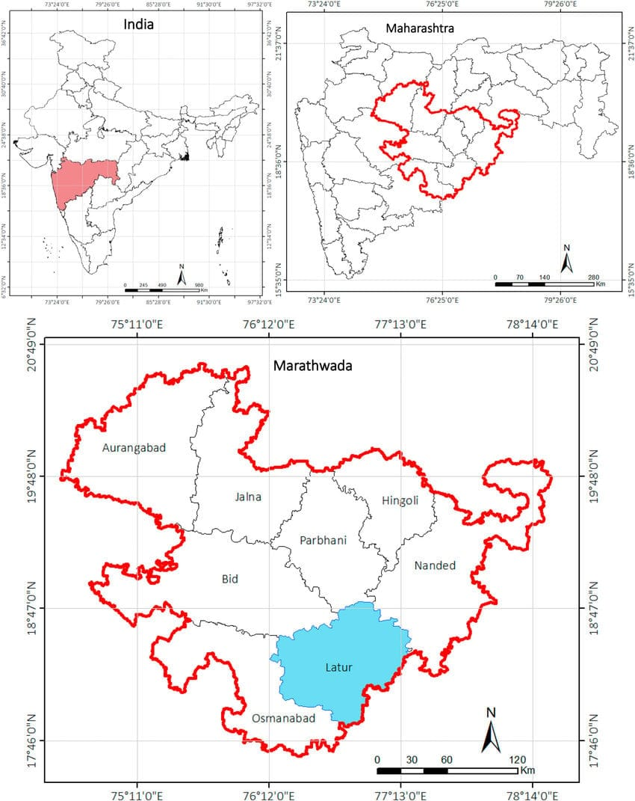
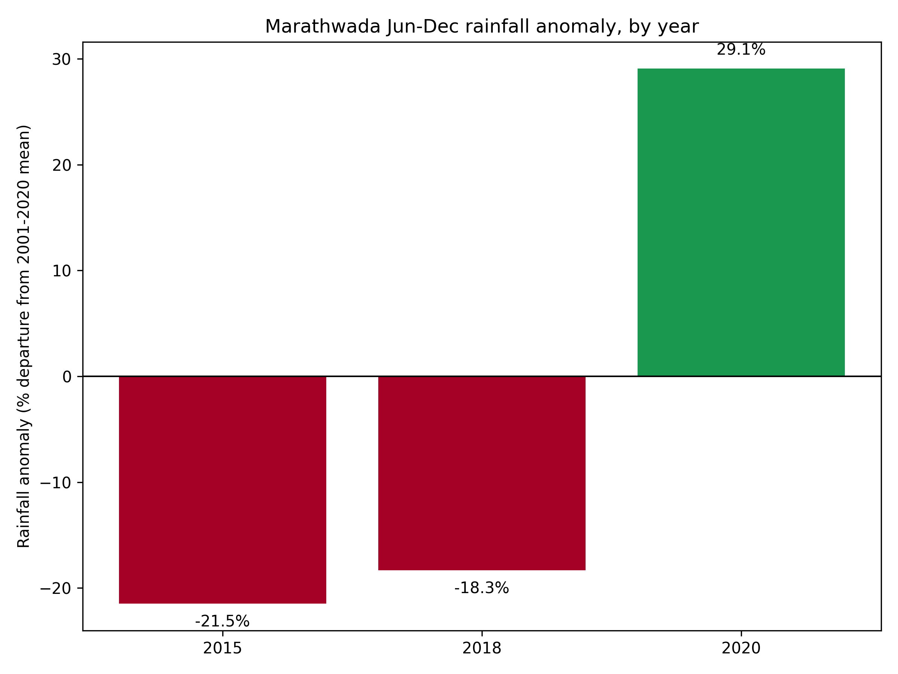

# Testing the Fluorescence Advantage: Solar-Induced Fluorescence as an Early Indicator of Agricultural Drought Stress in Marathwada, Maharashtra

## Abstract

Drought detection frameworks used for official drought declaration and agricultural insurance assessment in India rely substantially on rainfall-deficit records and the Normalized Difference Vegetation Index (NDVI), both of which respond to crop stress only after visible physiological degradation has already occurred. This study examines whether Solar-Induced Fluorescence (SIF), a satellite-derived proxy for photosynthetic activity, registers vegetation stress measurably earlier than NDVI during documented drought conditions. Using GOSIF v2 fluorescence data and cloud-screened MODIS NDVI over the Marathwada region of Maharashtra across two drought years (2015, 2018) and one normal monsoon year (2020), a quantitative lag was calculated between the two indices' post-peak seasonal decline. SIF's decline preceded NDVI's decline consistently across all three years studied, but the hypothesis that drought conditions amplify this lag was not supported: mean lag was smaller in the two drought years (14.6 days) than in the normal year (25.5 days), and the two drought years differed substantially from each other (24.2 versus 5.1 days). Independent validation using CHIRPS precipitation data confirmed the drought/normal classification (rainfall departures of −21.5%, −18.3%, and +29.1% from a twenty-year climatological normal, respectively) and revealed that the 2018 drought was spatially concentrated in the western and southern districts, while eastern districts recorded near-normal or surplus rainfall.District-level spatial analysis confirms this pattern statistically: mean SIF and rainfall anomaly are strongly and significantly correlated across districts and years (Pearson r = 0.837, p < 0.001; Spearman ρ = 0.857, p < 0.001), providing a physically coherent and quantitatively supported cross-validation between the two independently derived satellite datasets.

**Keywords**: solar-induced fluorescence, remote sensing, drought monitoring, NDVI, agricultural stress, Marathwada

## 1. Introduction

### 1.1 Motivation

The Normalized Difference Vegetation Index is a reflectance-based measure: it quantifies how much visible and near-infrared light a plant canopy reflects, and this reflectance changes only once a plant's internal structure has already begun to visibly degrade — thinning leaves, reduced chlorophyll content, canopy stress. Solar-Induced Fluorescence is grounded in a more direct physical process. When a leaf absorbs sunlight for photosynthesis, a small fraction of the absorbed energy is not converted into chemical energy but is instead re-emitted as fluorescence, governed by the quantum yield of photosynthesis. Under physiological stress, photosynthetic efficiency declines before outward greenness does, meaning SIF is expected to register stress earlier than NDVI. Where NDVI reflects a plant's outward appearance, SIF reflects what is occurring physiologically within it.

India's drought declaration process, and the crop-insurance payout mechanism under the Pradhan Mantri Fasal Bima Yojana (PMFBY) that depends on it, relies substantially on rainfall-deficit and NDVI-based assessment. Both indicators are known to register drought only after visible crop stress has already set in, and this delay translates directly into delayed insurance payouts at precisely the point when affected farmers require them most urgently. This study treats the existence and size of a SIF–NDVI lag as an empirical, testable question, with the aim of establishing whether such a lag constitutes a physics-based case for an earlier-warning indicator than those presently used in policy.

### 1.2 Physical Basis of Solar-Induced Fluorescence

When a leaf absorbs photosynthetically active radiation, the absorbed energy is partitioned among three competing, mutually exclusive pathways at the chlorophyll level: photochemistry (Φ_P), non-photochemical quenching or heat dissipation (Φ_NPQ), and chlorophyll fluorescence (Φ_F). These three pathways account for the entirety of absorbed energy, described by the conservation relationship:

Φ_P + Φ_NPQ + Φ_F = 1

Under well-watered, physiologically normal conditions, a large share of absorbed energy is directed toward photochemistry, with a comparatively small and relatively stable fraction re-emitted as fluorescence. Under drought or heat stress, the photochemical pathway is down-regulated as the photosynthetic apparatus protects itself from damage, while the non-photochemical quenching pathway is up-regulated to dissipate the resulting surplus energy as heat. This re-partitioning alters the fluorescence yield in a manner that is measurable before any outward change in canopy structure or greenness occurs, which is the physical basis for SIF's expected earlier-warning capacity relative to reflectance-based indices such as NDVI (Figure 1).

The magnitude of the fluorescence signal actually detected by a satellite sensor, denoted SIF, is the product of three quantities:

SIF = APAR × Φ_F × f_esc

where APAR is the absorbed photosynthetically active radiation, Φ_F is the fluorescence quantum yield described above, and f_esc is the fraction of emitted fluorescence photons that escape the canopy without being reabsorbed. Because chlorophyll fluorescence is several orders of magnitude weaker than reflected sunlight at the same wavelengths, it cannot be measured through simple radiance detection. Satellite-based SIF retrievals, as performed by instruments such as GOME-2, OCO-2, and TROPOMI, instead exploit narrow, naturally dark absorption features in the solar spectrum — Fraunhofer lines — where the additional radiance contributed by fluorescence emission can be isolated from the reflected background. The GOSIF product used in this study is not itself a direct satellite retrieval, but a statistically modeled reconstruction combining discrete OCO-2 SIF soundings with continuous MODIS reflectance data and meteorological reanalysis to produce spatially and temporally continuous global coverage.

**Figure 1.** Schematic representation of leaf-level light energy partitioning among photochemistry, non-photochemical quenching (heat dissipation), and chlorophyll fluorescence, under well-watered versus drought-stressed conditions.

### 1.3 Physical Basis of NDVI

The Normalized Difference Vegetation Index is computed from surface reflectance in the red and near-infrared bands:

NDVI = (NIR − RED) / (NIR + RED)

This formulation exploits a specific optical property of healthy plant tissue. In the red portion of the spectrum, chlorophyll pigments within the leaf's palisade mesophyll strongly absorb incoming light to drive photosynthesis, resulting in low red reflectance. In the near-infrared, by contrast, the internal leaf structure — specifically the irregular air-cell interfaces within the spongy mesophyll layer — causes strong multiple scattering due to the refractive-index mismatch between cell walls and intercellular air spaces, resulting in high near-infrared reflectance that is largely independent of chlorophyll content (Figure 2). A canopy with abundant, healthy, chlorophyll-rich foliage therefore produces a large contrast between low red and high near-infrared reflectance, yielding a high NDVI value; a canopy undergoing structural degradation — thinning leaves, reduced leaf area, senescence — reduces this contrast and lowers NDVI.

Because this signal depends on the plant's outward structural and pigment state, NDVI necessarily lags behind the internal physiological changes that precede visible degradation. Cloud and cloud-shadow contamination, arising from Mie scattering, further complicates the NDVI signal in the optical domain, an issue explicitly addressed in this study via MOD13Q1's `SummaryQA` per-pixel quality flag prior to any analysis (Section 3.1). This structural, appearance-based basis for NDVI stands in direct physical contrast to the internal-process basis of SIF described in Section 1.2, and this contrast is the central physical premise investigated throughout this study.

**Figure 2.** Leaf cross-section illustrating red-light absorption by chlorophyll in the palisade mesophyll versus near-infrared scattering at spongy mesophyll air-cell interfaces, the physical basis of the reflectance contrast measured by NDVI.

### 1.4 Research Questions

RQ1: Does SIF decline measurably earlier than NDVI during documented drought-onset periods in the study region?

RQ2: Is the SIF–NDVI lag, where present, consistent across the study region, or does it vary meaningfully by geography?

RQ3: How does the timing of SIF-based stress onset relate to independently measured rainfall deficit across drought and normal years?

### 1.5 Hypotheses

H1: SIF declines significantly before NDVI during a given drought episode.

H2: The magnitude of SIF–NDVI divergence is not spatially uniform across the study region.

H3: Drought severity, measured independently through rainfall deficit, amplifies the magnitude of the SIF–NDVI lag.

## 2. Study Area

The study region comprises the eight districts constituting Marathwada, Maharashtra — Chhatrapati Sambhajinagar (Aurangabad), Jalna, Parbhani, Hingoli, Nanded, Beed, Latur, and Dharashiv (Osmanabad) — selected for its recurring, well-documented history of agricultural drought.

**Figure 3.** Location of the study area. (a) Maharashtra state within India. (b) Marathwada division within Maharashtra. (c) The eight constituent districts of Marathwada, with Latur district highlighted for reference.

## 3. Data and Methodology

### 3.1 Data Sources

Four datasets were used, all covering the June 1 – December 31 window for 2015, 2018, and 2020:

- **SIF:** GOSIF v2, a global 0.05°, 8-day solar-induced fluorescence product (Li & Xiao, 2019), distributed by the Global Ecology Group, University of New Hampshire.
- **NDVI:** MODIS MOD13Q1, a 16-day, 250 m Vegetation Index product with an internal Maximum-Value-Composite cloud-suppression algorithm, accessed via Google Earth Engine.
- **Land cover:** MODIS MCD12Q1 (IGBP classification), used to derive a cropland mask (classes 12, 14).
- **Precipitation:** CHIRPS daily rainfall (UCSB-CHG), accessed via Google Earth Engine, for the three study years and for a twenty-year (2001–2020) climatological baseline.

### 3.2 Boundary Definition and Verification

The study region boundary was defined using the FAO GAUL 2015 level-2 administrative dataset, filtered to the eight Marathwada districts and merged into a single precise polygon. This replaced an initial rectangular bounding-box definition, which was found on visual inspection to extend beyond Marathwada into neighboring Telangana districts and into Solapur and Yavatmal — areas outside the study region with distinct rainfall regimes. Both the SIF raster-clipping pipeline (using polygon-based masking) and the NDVI extraction pipeline (using the same polygon as the reducer geometry) were built against this corrected boundary.

Following this correction, the masking behavior was independently verified by overlaying the true boundary polygon directly on a sample clipped SIF raster, confirming that data was retained only within the actual district outlines and excluded elsewhere.

**Figure 4.** Verification of boundary masking: clipped SIF data (color) overlaid with the true Marathwada district boundary (blue outline), confirming that raster values are correctly excluded outside the study region.

### 3.3 Processing Pipeline

SIF GeoTIFFs were clipped to the study boundary, scaled by GOSIF's 0.0001 factor, and masked for fill-value codes (32766, water; 32767, non-vegetated/missing) prior to averaging. NDVI was extracted using MOD13Q1's `SummaryQA` band (retaining good- and marginal-quality pixels only) combined with the cropland mask. The two series, at different native temporal resolutions (8-day SIF, 16-day NDVI), were aligned using nearest-date matching within each year.

### 3.4 Lag Calculation

Each year's SIF and NDVI series were normalized (0–1) within-year, and the day-of-year at which each series crossed a set of decline thresholds (90%, 80%, 70%, 60%, 50% of seasonal peak) was estimated via linear interpolation between observed dates. Lag was defined as the difference between the NDVI and SIF crossing dates at each threshold.

### 3.5 Rainfall Validation

CHIRPS-derived seasonal rainfall totals were computed for the three study years and compared against a twenty-year (2001–2020) climatological mean and standard deviation for the same region and seasonal window, yielding a percentage anomaly and z-score for each study year. This was extended to the district level using the same regional climatological baseline as a shared reference across all eight districts.

## 4. Results

### 4.1 Seasonal SIF–NDVI Trajectories

**Figure 5.** Normalized SIF and NDVI seasonal trajectories, Marathwada, 2015 (drought), 2018 (drought), and 2020 (normal monsoon). SIF's decline from seasonal peak precedes NDVI's decline in all three years.

Across all three years, SIF began its post-peak decline before NDVI, with NDVI remaining near its peak value for a longer period after SIF had already started dropping. This pattern was consistent regardless of drought classification.

### 4.2 Quantitative Lag Analysis

**Figure 6.** SIF-to-NDVI decline lag (days), by decline threshold and year.

Mean lag across all five resolved thresholds was 24.2 days (2015), 5.1 days (2018), and 25.5 days (2020). Grouped by drought classification, the two drought years averaged a smaller lag (14.6 days) than the normal year (25.5 days) — the opposite of the direction predicted by H3. The two drought years also differed substantially from one another (24.2 versus 5.1 days), a difference larger than either year's difference from the normal year.

### 4.3 Spatial Analysis — SIF

**Figure 7.** Spatial SIF distribution, day-of-year 273, 2015/2018/2020, masked to the precise Marathwada boundary.

**Figure 8.** Mean SIF by district, day-of-year 273, 2015/2018/2020.

Both the pixel-level and district-level spatial views show a consistent low-SIF zone concentrated in the western and southwestern districts (Aurangabad, Bid, Latur, Osmanabad) during both drought years, with Osmanabad recording the lowest district-level mean SIF in all three years studied (0.135, 0.151, 0.194 respectively). Nanded recorded the highest district-level mean SIF in all three years (0.233, 0.237, 0.265), with the smallest relative decline between drought and normal years.

### 4.4 Rainfall Validation

**Figure 9.** Regional rainfall anomaly (% departure from 2001–2020 climatological mean), by year.

Against a twenty-year climatological mean of 826.4 mm (σ = 158.8 mm) for the June–December window, 2015 recorded 648.9 mm (−21.5%), 2018 recorded 674.8 mm (−18.3%), and 2020 recorded 1066.6 mm (+29.1%). This independently confirms the drought/normal classification used throughout this study via measured precipitation deficit rather than assumption.

**Figure 10.** Rainfall anomaly by district (% departure from regional 20-year normal), 2015/2018/2020.

District-level rainfall anomaly reveals that the regional deficit was not spatially uniform. In 2018, Aurangabad (−37.2%) and Bid (−38.1%) recorded the largest deficits, while Hingoli (+10.4%) and Nanded (+14.6%) recorded rainfall surpluses in the same year, despite the region-wide figure indicating an 18.3% deficit. A comparable, though less pronounced, west-to-east gradient was present in 2015.

### 4.5 Combined Spatial Correspondence

**Figure 11.** SIF (top row) and rainfall anomaly (bottom row) by district, 2015/2018/2020, presented jointly for direct spatial comparison.

The low-SIF zone identified in Section 4.3 corresponds spatially, in both drought years, with the districts recording the largest rainfall deficits in Section 4.4. Nanded, which recorded the smallest rainfall deficit (or a surplus) in both drought years, also recorded the highest SIF values in the same years. 

This visual correspondence was additionally tested statistically across all 24 district-year observations (8 districts × 3 years). Mean SIF and rainfall anomaly (%) are strongly and significantly correlated: Pearson r = 0.837 (p < 0.001), and Spearman ρ = 0.857 (p < 0.001), confirming that the spatial pattern visible in Figure 11 is not an artifact of visual selection. This result carries one caveat: the 24 observations are not fully independent, since the eight districts are geographically adjacent and share regional weather systems, meaning the effective number of independent samples is closer to three (one per study year) than twenty-four. The correlation is reported as calculated, without adjustment for this, and is treated as strong corroborating evidence rather than a fully independent statistical confirmation.

**Figure 12.** District-level mean SIF plotted against rainfall anomaly (%), all 24 district-year observations (8 districts × 3 years), with a linear fit (Pearson r = 0.837, p < 0.001).

## 5. Discussion

The consistent SIF-leads-NDVI decline pattern observed across all three study years, independent of drought classification, supports the premise that SIF is a more temporally responsive indicator of the onset of physiological change than NDVI (RQ1, supporting H1 in its general form). However, the specific hypothesis that drought conditions amplify this lag (H3) is not supported: the two drought years produced a smaller average lag than the normal year, and differed substantially from one another. This indicates that the size of the SIF–NDVI lag, at least in this dataset, is not simply a function of drought severity as measured by rainfall deficit — a limitation discussed further below.

The magnitude of this discrepancy is itself worth discussing rather than only reporting: 2015 and 2018 recorded broadly similar rainfall deficits (−21.5% and −18.3% respectively, a difference of only about three percentage points), yet their SIF–NDVI lags differed by nearly a factor of five (24.2 versus 5.1 days). If lag size were driven primarily by the magnitude of the seasonal rainfall deficit, these two years would be expected to behave more similarly than they do. Several candidate explanations, none of which this study is able to test directly with the data collected, may account for this divergence. First, the two years may have differed in the timing of rainfall deficit within the season rather than only its total magnitude — a shortfall concentrated early in the monsoon, affecting crop establishment, could plausibly produce different post-peak decline dynamics than one concentrated later, closer to the harvest window that the lag metric specifically measures. Second, the coarser native temporal resolution of NDVI (16 days) relative to SIF (8 days), combined with linear-interpolation-based threshold-crossing estimation, could introduce differential dating uncertainty between years if the rate of post-peak decline itself varied — a steep, rapid decline is more sensitive to interpolation error than a gradual one. Third, inter-annual differences in dominant Kharif crop choice or sowing calendar within the same districts, which this study did not track, could alter the phenological timing of both indices independently of total rainfall deficit, since different crops exhibit different canopy structures and stress responses. Distinguishing among these explanations would require crop-type and sowing-date records this study did not acquire, and this divergence is reported as an open, unresolved finding rather than one this study is able to adjudicate.

The spatial analysis, combined with independent rainfall validation, provides evidence in support of RQ2: the SIF–NDVI relationship, and the underlying drought stress it reflects, is not spatially uniform across Marathwada. The west-to-east gradient present in both the SIF and rainfall datasets, particularly pronounced in 2018, suggests that region-wide averages used elsewhere in this study can obscure meaningful sub-regional variation.

## 6. Limitations

- The GOSIF product used for SIF in this study is not a direct satellite retrieval but a statistically modeled reconstruction that uses MODIS reflectance data, alongside OCO-2 SIF soundings and meteorological reanalysis, to produce continuous spatiotemporal coverage. Because MODIS reflectance is also the underlying data source for the NDVI product used for comparison, the two variables are not built from fully independent measurements at the input-data level. This is an inherent property of the most widely available continuous SIF product, not a design choice specific to this study, but it means the magnitude of the SIF-NDVI lag reported in Section 4.2 cannot be fully attributed to independent physical signals, and this study does not attempt to quantify or correct for the resulting modeling dependency.
- The sample size (three years: two drought, one normal) is small, and the two drought years differ substantially from one another, limiting generalizability of any drought/normal comparison.
- The spatial correspondence between rainfall deficit and SIF stress (Section 4.5) was tested via Pearson and Spearman correlation (r = 0.837, ρ = 0.857, both p < 0.001) rather than left as a purely visual comparison; however, with only three independent study years and eight geographically adjacent districts, the 24 district-year observations are not fully independent, and this correlation should be read as strong corroborating evidence rather than a formally independent statistical confirmation.
- The low-SIF zones identified have not been validated against ground-level crop-stress or drought-impact reporting for the districts concerned.
- District-level rainfall anomaly was computed relative to a single region-wide climatological baseline rather than a per-district climatology.
- This study does not directly compare SIF-based stress timing against official drought-declaration dates, which was outside the scope of the data acquired.

## 7. Conclusion

This study finds consistent evidence that Solar-Induced Fluorescence registers the onset of post-peak seasonal vegetation decline earlier than NDVI across all years studied in Marathwada, Maharashtra, supporting SIF's physical basis as a more temporally responsive stress indicator. It does not find evidence that this lag is amplified specifically by drought conditions, and identifies substantial inter-annual and intra-regional variation that a simple drought/normal binary does not capture. Independent rainfall validation and spatial cross-referencing between SIF and precipitation data lend physical coherence to the district-level findings, while several limitations — sample size, absence of ground validation, and the visual (rather than statistical) nature of the spatial cross-check — are reported directly rather than resolved beyond what the available data supports.

## References

Didan, K. (2021). *MODIS/Terra Vegetation Indices 16-Day L3 Global 250m SIN Grid V061* [Data set]. NASA EOSDIS Land Processes Distributed Active Archive Center. https://doi.org/10.5067/MODIS/MOD13Q1.061

Food and Agriculture Organization of the United Nations (FAO). (2015). *FAO GAUL (Global Administrative Unit Layers): Global Administrative Unit Layers 2015, Level 2* [Data set]. Google Earth Engine Data Catalog. https://developers.google.com/earth-engine/datasets/catalog/FAO_GAUL_2015_level2

Friedl, M., & Sulla-Menashe, D. (2022). *MODIS/Terra+Aqua Land Cover Type Yearly L3 Global 500m SIN Grid V061* [Data set]. NASA EOSDIS Land Processes Distributed Active Archive Center. https://doi.org/10.5067/MODIS/MCD12Q1.061

Funk, C., Peterson, P., Landsfeld, M., Pedreros, D., Verdin, J., Shukla, S., Husak, G., Rowland, J., Harrison, L., Hoell, A., & Michaelsen, J. (2015). The climate hazards infrared precipitation with stations—a new environmental record for monitoring extremes. *Scientific Data*, 2, Article 150066. https://doi.org/10.1038/sdata.2015.66

Li, X., & Xiao, J. (2019). A global, 0.05-degree product of solar-induced chlorophyll fluorescence derived from OCO-2, MODIS, and reanalysis data. *Remote Sensing*, 11(5), 517.

Ministry of Agriculture & Farmers Welfare, Government of India. (2016). *Pradhan Mantri Fasal Bima Yojana (PMFBY)*. Retrieved from https://pmfby.gov.in